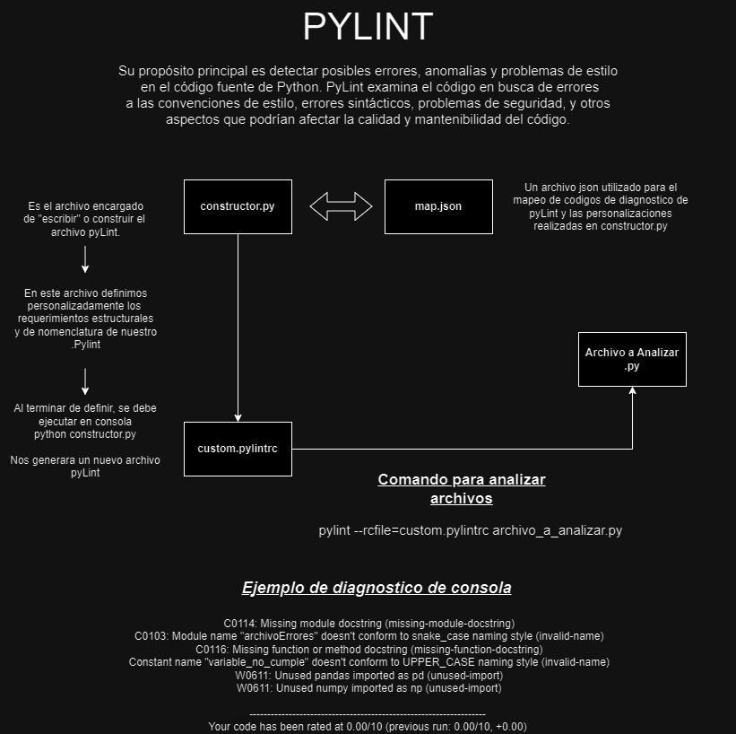

# Pylint

Su propósito principal es detectar posibles errores, anomalías y problemas de estilo
 en el código fuente de Python. PyLint examina el código en busca de errores
a las convenciones de estilo, errores sintácticos, problemas de seguridad, y otros
aspectos que podrían afectar la calidad y mantenibilidad del código.

## Diagrama de ejecucion

### El archivo **CONSTRUCTOR.PY** es el encargado de elaborar un arhivo .pylintrc  . Desde el se pueden definir ciertas notificaciones como:
##### Definir un formato de nombre y notificar cuando este no se cumpla, obligar a establecer un  Docstring en cada archivo, notificar de importaciones, variables o pass no utilizados.

#### - invalid-name (tipo de nombres, snake_case, UPPER_CASE) formato de nombre no admitido. 

#### - Docstring (descripcion de archivo) faltante en los archivos.

#### - Function Docstring (descripcion de funcion) faltante en las funciones.

#### - Unused-Import (Importacion no utilizada) en los archivos.

#### - Unused Constant ( Variable no utilizada) en los archivos.

#### - unnecessary-pass (Pass sin funcion) en los archivos.

### La funcion de constructor.py es muy simple.

#### - Se definen los requerimientos y necesidades de estructura, notificaciones y nomenclaturas.
#### - El codigo mapea el codigo correcto de la biblioteca pyLint con las necesidades puestas en nuestro archivo constructor.
#### - El codigo escribe el archivo .pylint con los codigos y requerimientos obtenidos mediante el json.
#### - El codigo crea un nuevo archivo .pylint asociado a los requerimientos puestos en el.

#####  Para ejecutar este archivo es necesario ejecutar en consola **python constructor.py** estando en el mismo directorio que el archivo.

### Al obtener el archivo .pylint, es necesario ejecutarlo asociando el nombre del archivo a analizar. Por ejemplo
### pylint --rcfile=custom.pylintrc archivo_a_analizar.py
#### Un ejemplo de lo que nos arroja la consola al terminar el analisis es :

 C0114: Missing module docstring (missing-module-docstring)
 C0103: Module name "archivoErrores" doesn't conform to snake_case naming style (invalid-name)
 C0116: Missing function or method docstring (missing-function-docstring)
 Constant name "variable_no_cumple" doesn't conform to UPPER_CASE naming style (invalid-name)
 W0611: Unused pandas imported as pd (unused-import)
 W0611: Unused numpy imported as np (unused-import)

------------------------------------------------------------------
Your code has been rated at 0.00/10 (previous run: 0.00/10, +0.00)

## Hasta el momento las personalizaciones admitidas son:

    IMPORTACION_NO_UTILIZADA     
    VARIABLE_NO_UTILIZADA
    METODO_NO_UTILIZADO
    LINEA_DEMASIADO_LARGA
    ESPACIOS_EN_BLANCO_NO_PERMITIDOS 
    FIRMA_FUNCION_INCORRECTA
    PASS_NO_UTILIZADO
    DOCSTRING_OBLIGATORIO
    DESCRIPCION_FUNCIONES
